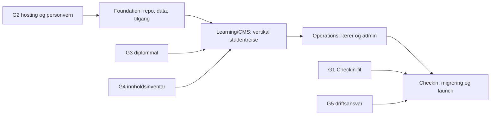

# Trenerutdanningsportalen V1 Implementation Plan

> **For agentic workers:** REQUIRED SUB-SKILL: Use superpowers:subagent-driven-development (recommended) or superpowers:executing-plans to implement this plan task-by-task. Steps use checkbox (`- [ ]`) syntax for tracking.

**Goal:** Levere en produksjonsklar Trenerutdanningsportal for NGF med invitert innlogging, læring/CMS, praksis og vurdering, lærer-/adminoppfølging, Checkin Excel-import, rapporter og objektivt administratorstyrt AI-søk før Trener 3 starter 3. februar 2027.

**Architecture:** Bygg en modulær monolitt i Next.js med strenge domenemoduler, server-side autorisasjon og Supabase/PostgreSQL som autoritativ datakilde. Checkin forblir system of record for påmelding og betaling; V1 importerer original Excel-eksport idempotent. All asynkron kommunikasjon går gjennom en database-outbox slik at invitasjoner, påminnelser og diplomer kan prøves på nytt uten duplikater.

**Tech Stack:** Next.js App Router, React, TypeScript strict, pnpm, PostgreSQL/Supabase Auth + Storage + RLS, Zod, skjemavalidert blokk-JSON, ExcelJS, React-PDF, OpenAI SDK bak allowlist-adapter, Vitest, Testing Library, Playwright, axe-core, MSW, GitHub Actions, Sentry og EU-hosting.

---

## 1. Planpakken

Kravbasen er [`docs/specs/2026-08-30-trenerutdanningsportalen-v1.md`](../../specs/2026-08-30-trenerutdanningsportalen-v1.md). Implementeringen er delt fordi hvert spor skal kunne levere og testes selvstendig:

| Rekkefølge | Plan | Leveranse |
|---:|---|---|
| 1 | [`2026-08-30-trenerutdanningsportalen-foundation.md`](2026-08-30-trenerutdanningsportalen-foundation.md) | Repository, CI, designbibliotek, datamodell, RLS, invitasjon, roller, kurs og audit. |
| 2 | [`2026-08-30-trenerutdanningsportalen-learning-cms.md`](2026-08-30-trenerutdanningsportalen-learning-cms.md) | CMS/publisering, læringsspiller, progresjon, quiz, innlevering, praksis, oppmøte, fullføring og diplom. |
| 3 | [`2026-08-30-trenerutdanningsportalen-operations.md`](2026-08-30-trenerutdanningsportalen-operations.md) | Lærer-/adminflater, trafikklys, varsler, rapporter, tilgangslivsløp, kontosammenslåing og objektivt AI-søk. |
| 4 | [`2026-08-30-trenerutdanningsportalen-checkin-launch.md`](2026-08-30-trenerutdanningsportalen-checkin-launch.md) | Checkin/historikkimport, Ungdomsdriven, innholdsmigrering, sikkerhet, UU, drift, UAT og produksjonssetting. |

Ingen plan kan markeres ferdig før alle avhengige planer og den samlede akseptansematrisen er grønne.

## 2. Arkitekturbeslutning

Planen velger **egen portal som modulær monolitt**. Valget er bevisst fordi kravene om elektronisk praksis, reversible deltakerstatuser, versjonert publisering, anbefalt mot faktisk progresjon, særskilt Trener 1-struktur, Checkin-import, objektivt AI-søk og Nivå Klassisk Premium samlet krever mer produktspesifikk arbeidsflyt enn et standard LMS normalt gir uten omfattende tilpasning.

Før Task 1 startes, skal NGF godkjenne følgende én-sides ADR:

```markdown
# ADR-001: Egen modulær portal for V1

Status: Accepted
Decision: Next.js modular monolith + Supabase PostgreSQL/Auth/Storage in EU.
Context: V1 requires NGF-specific learning, practice, progress, import and reporting workflows.
Consequences:
- NGF owns application lifecycle and product development.
- Checkin remains authoritative for enrollment/payment.
- NIF/Idrettens ID remains outside V1, behind a future identity adapter.
- Domains communicate through typed services and database events, not direct UI queries.
Rollback trigger: Stop before production data if G2 hosting/privacy approval is not obtained.
```

If NGF rejects the ADR, stop. Do not partially implement this plan in Moodle or another LMS; create a new implementation plan for the chosen platform.

## 3. Repository- og filkart

All ny produksjonskode ligger i `portal/`; den eksisterende `demo/` beholdes som visuell referanse og inneholder ingen produksjonslogikk.

```text
portal/
  src/app/                         # Ruter og serverkomposisjon; ingen domenelogikk
  src/components/ui/               # Nivå-komponenter og tokens
  src/features/access/             # Invitasjon, roller og autorisasjon
  src/features/courses/            # Kursmaler, gjennomføringer og samlinger
  src/features/content/            # CMS, versjoner, publisering og presentasjoner
  src/features/learning/           # Aktivitetstilgang, progresjon og avhengigheter
  src/features/assessment/         # Quiz, prøve, innlevering og vurdering
  src/features/practice/           # Praksislogg og godkjenningsflyt
  src/features/attendance/         # Oppmøte og universitetskrav
  src/features/completion/         # Sluttregler og diplom
  src/features/people/             # Deltakerstatus og reversibel kontosammenslåing
  src/features/notifications/      # Outbox, e-post og portalvarsler
  src/features/imports/            # Checkin- og historikkimport
  src/features/reporting/          # PDF, Excel og beregningsdefinisjoner
  src/features/admin-query/        # Allowlist-basert naturlig språk → dataintensjon
  src/lib/                         # Infrastrukturadaptere, logging og miljø
  supabase/migrations/             # Skjema, constraints, RLS og funksjoner
  tests/unit/                      # Rene domenetester
  tests/integration/               # Database, RLS, import og adaptertester
  tests/e2e/                       # Kritiske brukerreiser
  tests/fixtures/                  # Kun syntetiske/redigerte testfiler
  docs/adr/                        # Arkitekturbeslutninger
  docs/runbooks/                   # Drift, restore og hendelser
```

Regel: En React-komponent kan kalle en server action eller query i samme feature. Den kan ikke importere databaseklienten direkte. Domenefunksjoner tar eksplisitte verdier og returnerer typed resultater; de leser ikke globale sessions eller miljøvariabler.

Terminologi i kode: `profiles.id` er den stabile portalpersonen og omtales som `personId` i TypeScript/API. `user_accounts.user_id` er en autentiseringsidentitet fra Supabase. Flere auth-kontoer kan etter kontroll peke på samme stabile profil; domenedata peker aldri direkte på `auth.users`.

## 4. Leveranserekkefølge og harde porter



| Milepæl | Dato | Målbart resultat |
|---|---:|---|
| M0 Arkitektur og porter | 11. september | ADR godkjent, miljø valgt, Checkin-fixture mottatt eller formell blokkering registrert. |
| M1 Grunnmur | 2. oktober | Innlogging, roller, RLS, audit og kursoppretting fungerer i testmiljø. |
| M2 Vertikal studentreise | 30. oktober | Én Trener 1-modul kan publiseres, gjennomføres og spores; praksis/innlevering/oppmøte kan fullføres. |
| M3 Operativ portal | 20. november | Lærer og admin kan følge opp, importere, varsle, rapportere og bruke tillatte AI-spørsmål. |
| M4 90 prosent / release candidate | 11. desember | All V1-kode ferdig; bare innholdsinnlasting, UAT-funn og produksjonsforberedelse gjenstår. |
| M5 Pilotklar | 22. januar 2027 | Restore-test, opplæring, innhold og produksjonsdata kontrollert. |
| M6 Oppstart | 3. februar 2027 | Trener 3-kullet har tilgang og supportberedskap er aktiv. |

### Kapasitetsforutsetning

Datoene forutsetter to fulltids utviklingsspor fra 14. september til 11. desember, én NGF-produkteier tilgjengelig minst 1,5 dag per uke, én fag-/innholdsredaktør minst 2,5 dager per uke og navngitt personvern-/sikkerhetsressurs ved G2 og releasegate. Med bare én utvikler må enten rapport/AI, avansert CMS/presentasjon eller full Trener 1–3-bredde flyttes etter 3. februar; planen skal ikke late som samme omfang kan leveres med halv kapasitet.

Innhold og kode går parallelt etter at datamodell og maler er låst. Produkteier svarer på blokkeringer innen én arbeidsdag; ellers flyttes den berørte leveransen og teamet fortsetter på et uavhengig spor.

## 5. Kodekontroll — risikobasert kvalitetsport

Kontrollen skal finne reelle feil uten å gjøre hver liten endring treg. En vanlig PR skal få første svar fra CI innen **3–6 minutter**. Full kontroll kjøres ved milepæler, nattlig og før release candidate.

| Risiko | Eksempler | Kontroll før merge |
|---|---|---|
| Lav | Tekst, dokumentasjon, ren styling uten atferdsendring | Formatter, lint, typer og berørte komponenttester. Visuell kontroll bare på endret flate. Egenkontroll er nok; uavhengig review tas som stikkprøve. |
| Middels | Ny UI-flyt, beregning, rapport, varsling eller domeneregel | Hurtigport + failing/passing test for ny atferd + relevante integrasjonstester. Kort uavhengig review av endringen. |
| Høy | Auth, roller/RLS, migrering, import, filopplasting, AI, persondata, kontosammenslåing | Hurtigport + målrettet RLS/sikkerhet/E2E + uavhengig review. Hele suiten kjøres ved ferdig task/milepæl, ikke for hvert mellomcommit. |

**Hurtigport for alle kodeendringer:**

```bash
pnpm format:check
pnpm lint
pnpm typecheck
pnpm test:unit --run
```

**Målrettede jobber ved relevante filendringer:**

- `supabase/migrations`, `access`, `people`, `imports` eller `admin-query` → integrasjons- og RLS-jobb.
- `src/app`, `components` eller brukerflyt → berørte Playwright-scenarier og axe på endrede sider.
- Avhengighetsendring → dependency audit og lisenskontroll.
- Kun Markdown/ren tekst → ingen database eller E2E.

**Full milepælport:**

```bash
pnpm test:unit --run
pnpm test:integration --run
pnpm test:rls
pnpm build
pnpm playwright test
pnpm audit --prod --audit-level high
```

Forventet: alle valgte kommandoer avslutter med kode `0`. Fullporten kjøres etter hver delplan, nattlig på hovedgren og før RC. Kritiske sårbarheter kan aldri unntas; høye funn krever datert eierført risikovurdering.

TDD kreves for forretningsregler, feilrettinger og sikkerhetsgrenser. Ren kopi og visuell finjustering trenger ikke en kunstig enhetstest, men skal ha relevant visuell/UU-kontroll. Generert kode får samme risikoklasse som håndskrevet kode; det er risikoen, ikke hvem som skrev den, som bestemmer kontrollmengden.

### Stop-the-line-regler

- Feil som kan vise data på tvers av kurs eller roller stopper all videre feature-utvikling til de er løst.
- Ikke-reverserbar migrering må ha dokumentert backup- og rollback-test før produksjon.
- Generert kode med ukjent lisens, kopiert hemmelighet, fri SQL fra AI eller persondata i logger avvises.
- Flaky test deaktiveres ikke; den isoleres, får eier og fikses før release candidate.
- «Fungerer på min maskin» er ikke godkjenning; CI-artefakt og akseptansebevis kreves.

## 6. Samlet ende-til-ende-test

Opprett `portal/tests/e2e/full-pilot-journey.spec.ts` i siste plan med denne reisen:

```ts
import { test, expect } from "@playwright/test";

test("Trener 3 pilot from invitation to diploma", async ({ page }) => {
  await page.goto("/test-login?as=admin");
  await page.getByRole("link", { name: "Importer fra Checkin" }).click();
  await page.getByLabel("Excel-fil").setInputFiles("tests/fixtures/checkin/trener3.xlsx");
  await expect(page.getByText("15 nye deltakere")).toBeVisible();
  await page.getByRole("button", { name: "Bekreft import" }).click();

  await page.goto("/test-login?as=student-nora");
  await expect(page.getByRole("heading", { name: "Fortsett der du slapp" })).toBeVisible();
  await page.getByRole("link", { name: "Planlegging av treningsøkt" }).click();
  await page.getByRole("button", { name: "Marker som fullført" }).click();

  await page.goto("/test-login?as=teacher-t3");
  await page.getByRole("link", { name: "Nora Vik" }).click();
  await expect(page.getByText("I rute")).toBeVisible();

  await page.goto("/test-login?as=admin");
  await page.getByRole("button", { name: "Hvor mange har fullført?" }).click();
  await expect(page.getByText(/Definisjon: 100 %/)).toBeVisible();
});
```

Testbrukerruten kompileres bare når `E2E_TEST_MODE=true`; byggtesten skal bevise at den returnerer `404` i produksjonsmodus.

## 7. Releasegate

Release candidate kan merkes `v1.0.0-rc.1` bare når:

- alle fem eksterne porter i kravbasen har dokumentert bevis;
- alle fire delplaner er fullført og committene er reviewet;
- 100 prosent av kritiske domeneregler har enhetstest og 100 prosent av tillatelsesmatrisen har RLS-integrasjonstest;
- de fem V1-ferdigkriteriene i kravbasen er demonstrert med syntetiske data;
- ingen åpne kritiske/høye sikkerhets- eller UU-funn finnes;
- restore-testen møter godkjent RPO/RTO og produksjonsberedskap er signert av navngitt NGF-eier.

## 8. Kravsporbarhet

| Kravområde i spec | Implementasjon | Obligatorisk bevis |
|---|---|---|
| §3–4 roller, kurs og samlinger | Foundation Task 3–6 | RLS-matrise, ni T1-runs, T2/T3-samlinger og cross-course 404. |
| §5 studentens neste handling | Learning/CMS Task 3–4 | Student-E2E på 390/1280 px med én dominant handling. |
| §6 CMS/presentasjon/publisering | Learning/CMS Task 1–2 | Kladd usynlig for student, separat presentasjon og immutable versjonstest. |
| §7 progresjon, bridge og quiz | Learning/CMS Task 3–5; Operations Task 1 | Vektberegning, låseforklaring, retry-delay og trafikklystester. |
| §8 innlevering | Learning/CMS Task 6 | Full versjonert utbedringsrunde med ny frist. |
| §9 praksis | Learning/CMS Task 7 | 45/9-timersgrense, delay, idempotens og stikkprøve. |
| §10 oppmøte/fullføring/diplom | Learning/CMS Task 8; Launch Task 4 | 80 %, universitetskontroll, Youth Drive-task og identisk diplomjobb. |
| §11 status/identitet/alder | Foundation Task 5; Operations Task 4; Launch Task 2 | Withdraw/reopen, reversibel merge, anonymisering og 15-årskontroll. |
| §12 Checkin/historikk | Launch Task 1–3 | Golden fixture, dobbelimport uten duplikat, manglende rad beholder tilgang og T3-startår. |
| §13 varsler | Operations Task 3 | Dobbel worker gir én e-post; manuell/faste påminnelser og PII-redaksjon. |
| §14 lærer/admin | Operations Task 2 og 7 | Rollebaserte arbeidsflater, arbeidskø og direkte URL-avslag. |
| §15 rapporter/AI | Operations Task 5–6 | Syv PDF/XLSX-rapporter, allowlist-intensjoner, read-only DB og prompt-injection-test. |
| §16 UU/sikkerhet/personvern | Launch Task 6–7 | Axe/manuell UU, CodeQL/audit, threat model, RLS, PII-loggtest, last og restore. |
| §17–19 porter og ferdigkriterier | Launch Task 8 | Signert UAT, release evidence, canary, overvåking og rollbackmål. |

## 9. Gjennomføringskontroll

Etter hver task skal ansvarlig oppdatere denne tabellen i PR-beskrivelsen:

```markdown
| Kontroll | Bevis |
|---|---|
| Krav | SPEC §x / krav-ID |
| Failing test | CI-lenke eller terminalutdrag |
| Passing test | CI-lenke |
| Rolle-/RLS-test | testnavn |
| UI/UU | 390 px + 1280 px + axe-resultat |
| Migrering/rollback | kommando og resultat, eller «ikke relevant» med grunn |
| Reviewer | navn + godkjent tidspunkt |
```

Planen er «vanntett» i betydningen at ukjent informasjon er gjort til eksplisitte stopp-porter, ikke skjulte antakelser. Den er ikke en garanti mot endrede krav; endringer går gjennom en ny spec-versjon, påvirkningsanalyse og oppdatert plan før kode endres.
